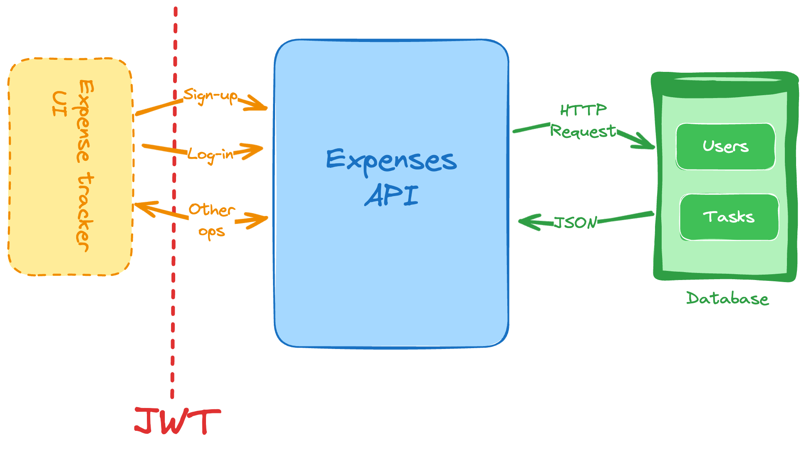

# 4. Expense Tracker API

```
Difficulty: Easy

Skills and technologies used: REST API design, data modeling, JWT authentication, MongoDB, Mongoose.
```

```
For the last of our “easy” backend projects, let’s cover one more API, an expense tracker API. This API should let you:

    Sign up as a new user.

    Generate and validate JWTs for handling authentication and user session.

    List and filter your past expenses. You can add the following filters:

        Past week.

        Last month.

        Last 3 months.

        Custom (to specify a start and end date of your choosing).

    Add new expenses.

    Remove existing expenses.

    Update existing expenses.

Let’s now add some constraints:

    You’ll be using JWT (JSON Web Token) to protect the endpoints and to identify the requester.

    For the different expense categories, you can use the following list (feel free to decide how to implement this as part of your data model):

        Groceries

        Leisure

        Electronics

        Utilities

        Clothing

        Health

        Others.

As a recommendation, you can use MongoDB or an ORM for this project, such as Mongoose (if you’re using JavaScript/Node for this).

From everything you’ve done so far, you should feel pretty confident next time you have to build a new API.
```

## Project Flow

```text
User Registration/Login Flow:
[Client] -> POST /api/auth/register or /api/auth/login
                 -> [auth.controller.js] Hash password / Verify password
                 -> [models/User.model.js] Save user / Retrieve user
                 -> [JWT] Generate token on login
                 -> [Response] Send token to client
```

```text
Expense Management Flow:
[Client + JWT Token] -> POST /api/expenses or GET /api/expenses
                                        -> [middleware/auth.js] Verify token
                                        -> [controllers/expense.controller.js] Process request
                                        -> [models/Expense.model.js] Save/Retrieve/Update/Delete expense
                                        -> [Response] Return expense data
```

## How The Project Works

1. `index.js` starts the server and loads environment variables.
2. `app.js` creates the Express app, connects to MongoDB, enables JSON parsing, and mounts the routes.
3. `routes/auth.routes.js` defines register and login endpoints.
4. `routes/expense.routes.js` defines expense CRUD endpoints and protects them with JWT middleware.
5. `controllers/auth.controller.js` handles registration and login.
6. `controllers/expense.controller.js` handles expense create, read, update, and delete logic.
7. `middleware/auth.js` verifies the JWT token and attaches the authenticated user to the request.
8. `models/User.model.js` defines the user schema.
9. `models/Expense.model.js` defines the expense schema and category validation.
10. MongoDB stores users and expenses, while Mongoose handles schema validation.

## File Roles

### `index.js`
Starts the app on the configured port.

```js
import dotenv from 'dotenv';
dotenv.config();

import app from './app.js';

const PORT = process.env.PORT || 3000;

app.listen(PORT, () => {
    console.log(`Server is running on port ${PORT}`);
});
```

### `app.js`
Creates the Express app, connects to MongoDB, and mounts the routes.

```js
app.use(express.json());
app.use('/api/auth', authRoutes);
app.use('/api/expenses', expenseRoutes);
```

### `routes/auth.routes.js`
Handles user registration and login.

```js
router.post('/register', register);
router.post('/login', login);
```

### `routes/expense.routes.js`
Protects all expense endpoints with JWT middleware and exposes CRUD routes.

```js
router.use(authMiddleware);

router.post('/', expenseController.createExpense);
router.get('/', expenseController.getExpenses);
router.get('/:id', expenseController.getExpenseById);
router.put('/:id', expenseController.updateExpense);
router.delete('/:id', expenseController.deleteExpense);
```

### `controllers/auth.controller.js`
Handles sign up and login.

**Register**:
- Checks whether the email already exists
- Hashes the password with bcryptjs
- Saves the new user with `password_hash`

**Login**:
- Finds the user by email
- Compares the provided password with the stored hash
- Generates a JWT token with the user id

### `controllers/expense.controller.js`
Handles all expense operations for the authenticated user.

- `createExpense` creates a new expense for `req.user._id`
- `getExpenses` returns all expenses for the current user
- `getExpenseById` returns one expense owned by the current user
- `updateExpense` updates an expense owned by the current user
- `deleteExpense` deletes an expense owned by the current user

The list endpoint also supports filters through the query string:

- `GET /api/expenses?filter=week`
- `GET /api/expenses?filter=month`
- `GET /api/expenses?filter=year`

### `middleware/auth.js`
Verifies the JWT token from the request header and makes the authenticated user available on the request object.

### `models/User.model.js`
Defines the user schema.

```js
const userSchema = new mongoose.Schema(
    {
        name: { type: String, required: true, trim: true },
        email: { type: String, required: true, unique: true, lowercase: true },
        password_hash: { type: String, required: true },
        createdAt: { type: Date, default: Date.now }
    },
    { timestamps: true }
);
```

### `models/Expense.model.js`
Defines the expense schema and validates the category field against a fixed set of values.

```js
const expenseSchema = new mongoose.Schema(
    {
        user: { type: mongoose.Schema.Types.ObjectId, ref: 'User', required: true },
        title: { type: String, required: true, trim: true },
        amount: { type: Number, required: true },
        category: { type: String, enum: EXPENSE_CATEGORIES, required: true },
        notes: { type: String, trim: true },
        createdAt: { type: Date, default: Date.now },
        updatedAt: { type: Date, default: Date.now }
    },
    { timestamps: true }
);
```

## API Endpoints

### Authentication

| Action | Method | Route | Body | Purpose |
| --- | --- | --- | --- | --- |
| Register | `POST` | `/api/auth/register` | `{ name, email, password }` | Create a new user account |
| Login | `POST` | `/api/auth/login` | `{ email, password }` | Authenticate and receive JWT token |

### Expenses

All expense routes require a valid JWT token in the `Authorization` header.

| Action | Method | Route | Body | Purpose |
| --- | --- | --- | --- | --- |
| Create | `POST` | `/api/expenses` | `{ title, amount, category, notes }` | Add a new expense |
| Read All | `GET` | `/api/expenses` | N/A | List all expenses for the current user |
| Read One | `GET` | `/api/expenses/:id` | N/A | Get one expense by id |
| Update | `PUT` | `/api/expenses/:id` | `{ title, amount, category, notes }` | Update an expense by id |
| Delete | `DELETE` | `/api/expenses/:id` | N/A | Remove an expense by id |

## Setup Instructions

### 1. Install dependencies
```bash
npm install
```

### 2. Create `.env` file
```env
MONGODB_URI=mongodb://localhost:27017/expense-tracker-api
JWT_SECRET=your-secret-key-here
PORT=3000
```

### 3. Run the server
```bash
npm run dev
```

Server will start on http://localhost:3000

## Example Requests

### Register a new user
```bash
curl -X POST http://localhost:3000/api/auth/register \
    -H "Content-Type: application/json" \
    -d '{"name":"John Doe","email":"john@example.com","password":"password123"}'
```

### Login to get a JWT token
```bash
curl -X POST http://localhost:3000/api/auth/login \
    -H "Content-Type: application/json" \
    -d '{"email":"john@example.com","password":"password123"}'
```

### Create an expense
```bash
curl -X POST http://localhost:3000/api/expenses \
    -H "Content-Type: application/json" \
    -H "Authorization: Bearer YOUR_TOKEN_HERE" \
    -d '{"title":"Groceries","amount":45.5,"category":"Groceries","notes":"Weekly shopping"}'
```

### Get all expenses
```bash
curl -X GET http://localhost:3000/api/expenses \
    -H "Authorization: Bearer YOUR_TOKEN_HERE"
```

### Filter expenses
```bash
curl -X GET "http://localhost:3000/api/expenses?filter=week" \
    -H "Authorization: Bearer YOUR_TOKEN_HERE"
```

## Learning Flow

When you come back to this project later, read it in this order:

`index.js` -> `app.js` -> `routes/auth.routes.js` -> `routes/expense.routes.js` -> `controllers/auth.controller.js` -> `controllers/expense.controller.js` -> `middleware/auth.js` -> `models/User.model.js` -> `models/Expense.model.js`
