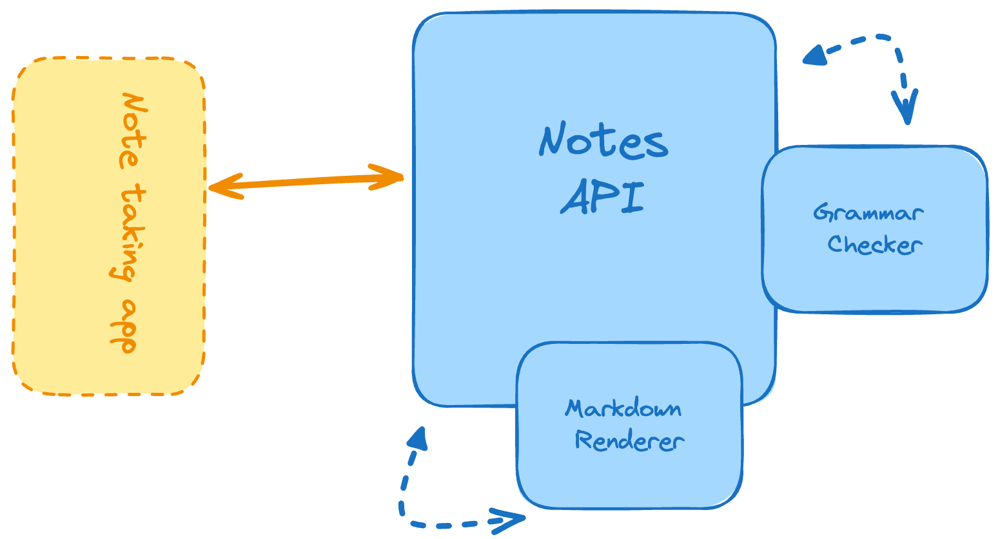

# 5. Markdown Note-taking App


```
Difficulty: Moderate

Skills and technologies used: Text processing, Markdown libraries, persistent storage, REST API with file upload.
```

```
You’ve been building APIs all this time, so that concept alone should not be a problem by now. However, we’re increasing the difficulty by allowing file uploads through your RESTful API. You’ll need to understand how that part works inside a RESTful environment and then figure out a strategy to store those files while avoiding name collisions.

You’ll also have to process the text in the following ways:

    You’ll provide an endpoint to check the grammar of the note.

    You’ll also provide an endpoint to save the note that can be passed in as Markdown text.

    Return the HTML version of the Markdown note (rendered note) through another endpoint.

As a recommendation, if you’re using JavaScript for this particular project, you could use a library such as Multer, which is a Node.js module.
```


## Features

- Create notes with `title`, `contentMarkdown`, and precomputed `renderedHtml`.
- Store `attachments` (filename, mime type, size and URL).
- Serve rendered HTML directly via a render endpoint.
- File upload endpoint that saves files to `uploads/` using Multer.
- A simple grammar check endpoint using `write-good`.

## Quick Start

1. Copy or create a `.env` with:

```
MONGODB_URI=mongodb://localhost:27017/notes_db
PORT=5000
```

2. Install dependencies:

```bash
npm install
```

3. Start the app in development:

```bash
npm run dev
```

The API will be available at `http://localhost:5000/api/notes` by default.

## File Roles

- `index.js` — starts the server.
- `app.js` — creates the Express app, connects to MongoDB and mounts routes.
- `routes/notes.routes.js` — route definitions for notes and uploads.
- `controllers/` — (not strictly separated in this project) request handling lives in the routes file.
- `models/note.model.js` — Mongoose schema for notes (fields: `title`, `contentMarkdown`, `renderedHtml`, `attachments`, timestamps).
- `middlewares/upload.middleware.js` — Multer storage configuration for `uploads/`.
- `services/markdown.service.js` — renders markdown to HTML using `marked`.

## API Summary

| Action | Method | Route | Purpose |
| --- | --- | --- | --- |
| Create | `POST` | `/api/notes` | Create a new note (send JSON with `title`, `contentMarkdown`, optional `attachments`) |
| Read All | `GET` | `/api/notes` | List notes |
| Read One | `GET` | `/api/notes/:id` | Get a single note by id |
| Render HTML | `GET` | `/api/notes/:id/render` | Return the pre-rendered HTML for a note |
| Update | `PUT` | `/api/notes/:id` | Partial update; `renderedHtml` is only recomputed when `contentMarkdown` is provided |
| Delete | `DELETE` | `/api/notes/:id` | Delete a note |
| Upload file | `POST` | `/api/notes/upload` | Upload a single file field named `file` (multipart/form-data) |
| Grammar check | `POST` | `/api/notes/check-grammar` | Returns suggestions from `write-good` |

### Upload notes

- The upload endpoint expects `multipart/form-data` with the file field named `file`.
- When using browser `FormData`, do NOT set the `Content-Type` header manually — let the browser set the multipart boundary.
- If the upload stream is truncated you will see a `400` response advising the request shape be corrected.

## Development Notes

- The `PUT /api/notes/:id` handler performs partial updates and will only re-render HTML when `contentMarkdown` is included in the request body. This avoids accidentally wiping existing HTML when updating only the title.
- Uploaded files are saved to the `uploads/` folder by default. Ensure the folder exists and is writable.

## Learning Flow

Read the project in this order for the request lifecycle:

`index.js` -> `app.js` -> `routes/notes.routes.js` -> `services/markdown.service.js` -> `models/note.model.js`
