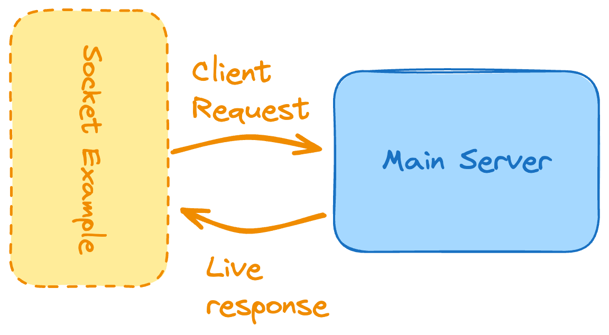

# 7. Real-time Polling App


```
Difficulty: Moderate

Skills and technologies used: WebSockets, live data updates, state management
```

```
Time to leave APIs alone for a while and focus on real-time interactions, another hot topic in web development. In fact, let’s try to use some sockets.

Sockets are a fantastic way of enabling 2-way communication between two or more parties (systems) with very few lines of code. Read more about sockets here.

That being said, we’re building both a client and a server for this project. The client can easily be a CLI (Command Line Interface) tool or a terminal program that will connect to the server and show the information being returned in real-time.

The flow for this first socket-based project is simple:

    The client connects to the server and sends a pre-defined request.

    The server upon receiving this request, will send, through the same channel, an automatic response.

While the flow might seem very similar to how HTTP-based communication works, the implementation is going to be very different. Keep in mind that from the client perspective, the request is sent, and there is no waiting logic, instead, the client will have code that gets triggered when the message from the server is received.

This is a great first step towards building more complex socket-based systems.
```

## What The App Does

- Starts an HTTP server on port `3000`.
- Opens a Socket.IO channel for real-time communication.
- Sends the current poll results to each client as soon as they connect.
- Accepts votes for one of the available options.
- Broadcasts updated results to all connected clients after every valid vote.
- Rejects invalid options with a socket error message.

## Poll Data

The current poll is stored in memory inside `index.js`:

```js
const polls = {
    poll1: {
        question: "Favorite Programming Language?",
        options: {
            JavaScript: 0,
            Python: 0,
            Rust: 0,
        },
    },
};
```

Because this data lives in memory, all vote counts reset when the server restarts.

## How The Project Works

1. `index.js` creates the Express app, the HTTP server, and the Socket.IO server.
2. When a socket client connects, the server sends the current poll through the `pollResults` event.
3. The client sends a `vote` event with the selected option name.
4. The server validates the option, increments the vote count, and broadcasts the updated poll to everyone.
5. If the option is invalid, the server responds with `errorMessage`.
6. `client.js` connects from the terminal, prints live results, and keeps asking for the next vote.

## File Roles

### `index.js`
Starts the server and handles all socket events.

```js
io.on("connection", (socket) => {
    socket.emit("pollResults", polls.poll1);

    socket.on("vote", (data) => {
        const { option } = data;
        const poll = polls.poll1;

        if (!poll.options.hasOwnProperty(option)) {
            socket.emit("errorMessage", { error: "Invalid voting option" });
            return;
        }

        poll.options[option]++;
        io.emit("pollResults", poll);
    });
});
```

### `client.js`
Connects to the server using `socket.io-client`, prints updates, and lets the user vote from the terminal.

```js
socket.on("pollResults", (poll) => {
    console.log(`\n${poll.question}\n`);
    for (const option in poll.options) {
        console.log(`${option}: ${poll.options[option]} votes`);
    }
});
```

### `package.json`
Defines the project as an ES module app and includes the runtime dependencies.

```json
{
  "type": "module",
  "scripts": {
    "dev": "nodemon index.js"
  }
}
```

## Socket Events

### Server to Client

| Event | Payload | Purpose |
| --- | --- | --- |
| `pollResults` | `{ question, options }` | Sends the current poll state to a client or broadcasts updated results |
| `errorMessage` | `{ error }` | Returns a validation error when the selected option is invalid |

### Client to Server

| Event | Payload | Purpose |
| --- | --- | --- |
| `vote` | `{ option }` | Submits a vote for one of the available poll options |

## Project Flow

```text
Terminal Client
    -> socket.io-client
    -> vote event
    -> Socket.IO server in index.js
    -> validate option
    -> update in-memory poll data
    -> broadcast pollResults
    -> all connected clients update instantly
```

## Setup Instructions

### 1. Install dependencies

```bash
npm install
```

### 2. Start the server

```bash
npm run dev
```

The server runs on `http://localhost:3000`.

### 3. Start the CLI client

Open a second terminal in the same folder and run:

```bash
node client.js
```

## How To Vote

When the client connects, it prints the live poll and then asks for your vote:

```text
Choose your vote:
1. JavaScript
2. Python
3. Rust
```

Type the option name exactly as shown:

```bash
JavaScript
Python
Rust
```

If you enter anything else, the server responds with `Invalid voting option`.

## Example Run

### Start the server

```bash
npm run dev
```

Expected output:

```text
Server running on port 3000
```

### Start the client

```bash
node client.js
```

Expected output:

```text
Connected to server: SOCKET_ID_HERE

========== LIVE POLL RESULTS ==========

Favorite Programming Language?

JavaScript: 0 votes
Python: 0 votes
Rust: 0 votes
```

## Learning Flow

If you revisit the project later, read it in this order:

`index.js` -> `client.js` -> `package.json`

That gives you the full path from the server setup to the terminal client and the socket events in between.