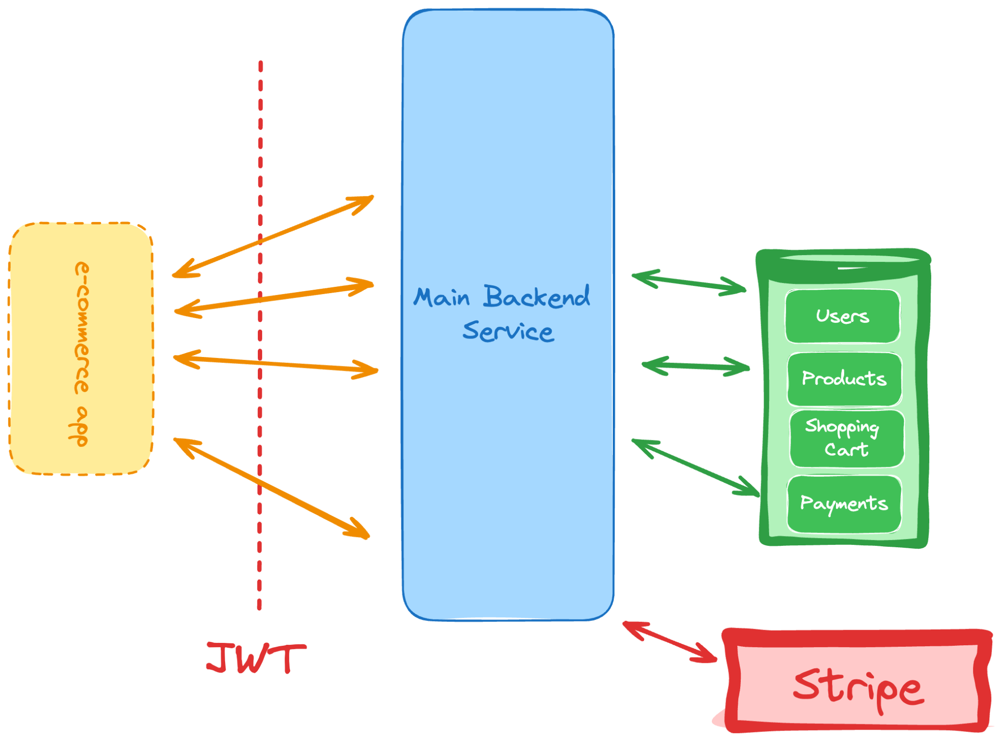

# 8. Simple E-commerce API

<span style="color:yellow">We are using Razorpay here instead of Stripe.</span>

```
Difficulty: Moderate

Skills and technologies used: Shopping cart logic, payment gateway integration, product inventory management
```

```
Back to the world of APIs, this time around we’re pushing for a logic-heavy implementation.

For this one, you’ll have to keep in mind everything we’ve been covering so far:

    JWT authentication to ensure many users can interact with it.

    Interaction with external services. Here you’ll be integrating with payment gateways such as Stripe.

    A complex data model that can handle products, shopping carts, and more.

With that in mind, let’s take a look at the responsibilities of this system:

    JWT creation and validation to handle authorization.

    Ability to create new users.

    Shopping cart management, which involves payment gateway integration as well.

    Product listings.

    Ability to create and edit products in the database.

This project might not seem like it has a lot of features, but it compensates in complexity, so don’t skip it, as it acts as a great progress check since it’s re-using almost every skill you’ve picked up so far.
```

## Core Flow

```text
User adds items to cart
        ↓
User clicks checkout
        ↓
Backend validates cart and stock
        ↓
Backend creates internal Order
        ↓
Backend creates Razorpay Order
        ↓
Frontend opens Razorpay popup
        ↓
User pays
        ↓
Backend verifies payment signature
        ↓
Order marked paid
        ↓
Inventory reduced
        ↓
Cart cleared
```

## Key Features

- User authentication with JWT
- Product management for admin users
- Cart management per authenticated user
- Order creation from cart with DB-backed price snapshots
- Razorpay order creation in paise
- Payment signature verification with HMAC SHA256
- Webhook support for payment events
- Stock reduction only after successful payment confirmation
- Order status and payment status tracking

## Project Structure

1. `app.js` creates the Express app, enables JSON parsing, captures raw request bodies for webhooks, and mounts the routes.
2. `index.js` connects to MongoDB and starts the server.
3. `middleware/auth.js` verifies JWT tokens and restricts admin-only routes.
4. `models/Product.model.js` defines products, stock, price, and active state.
5. `models/Cart.model.js` stores temporary cart items per user.
6. `models/Order.model.js` stores the permanent checkout snapshot, payment fields, and shipping address.
7. `controllers/cart.controller.js` manages cart add, update, remove, list, and clear operations.
8. `controllers/order.controller.js` creates orders from cart data and exposes order read endpoints.
9. `controllers/payment.controller.js` creates Razorpay payment orders, verifies payment signatures, and handles webhooks.
10. `services/order.service.js` contains the business logic for order creation and fulfillment.
11. `services/payment.service.js` contains Razorpay order creation, signature verification, and webhook handling.
12. `config/razorpay.js` initializes the Razorpay client lazily from environment variables.

## File Roles

### `app.js`
Sets up the Express app, mounts route groups, and preserves the raw request body needed for webhook signature verification.

```js
app.use(express.json({
  verify: (req, res, buf) => {
    req.rawBody = buf.toString('utf8');
  }
}));

app.use('/api/users', Userouter);
app.use('/api/products', Productrouter);
app.use('/api/cart', Cartrouter);
app.use('/api/orders', Orderouter);
app.use('/api/payments', Paymentrouter);
```

### `models/Order.model.js`
Stores the checkout snapshot and payment lifecycle.

Important fields:
- `items[]` with `productId`, `nameSnapshot`, `priceSnapshot`, `quantity`, and `subtotal`
- `subtotal` and `totalAmount`
- `paymentStatus`
- `fulfillmentStatus`
- `orderStatus`
- `razorpayOrderId`
- `razorpayPaymentId`
- `razorpaySignature`
- `shippingAddress`

### `services/order.service.js`
Handles the real checkout logic.

Responsibilities:
- Validate shipping address
- Read the cart from MongoDB
- Recalculate totals from product data
- Create the internal order snapshot
- Validate stock before payment finalization
- Reduce stock after successful payment
- Clear cart after completion

### `services/payment.service.js`
Handles Razorpay-related logic.

Responsibilities:
- Create Razorpay payment orders
- Verify payment signatures with HMAC SHA256
- Process payment webhooks
- Prevent duplicate fulfillment

## API Endpoints

### Orders

All order routes require a valid JWT token in the `Authorization` header.

| Action | Method | Route | Body | Purpose |
| --- | --- | --- | --- | --- |
| Create order from cart | `POST` | `/api/orders/create` | `{ shippingAddress, notes }` | Create internal order snapshot from cart |
| List all orders | `GET` | `/api/orders` | N/A | Admin-only order listing |
| Get order by id | `GET` | `/api/orders/:id` | N/A | Get one order if owned by user or admin |

### Payments

All payment routes except the webhook require a valid JWT token.

| Action | Method | Route | Body | Purpose |
| --- | --- | --- | --- | --- |
| Create Razorpay order | `POST` | `/api/payments/create-order` | `{ orderId }` | Create a Razorpay payment order for an internal order |
| Verify payment | `POST` | `/api/payments/verify` | `{ razorpay_order_id, razorpay_payment_id, razorpay_signature }` | Verify payment signature and mark order paid |
| Webhook | `POST` | `/api/payments/webhook` | Razorpay webhook payload | Backend-to-backend payment confirmation |

### Cart

| Action | Method | Route | Body | Purpose |
| --- | --- | --- | --- | --- |
| Add to cart | `POST` | `/api/cart/add` | `{ productId, quantity }` | Add an item to the user cart |
| Get cart | `GET` | `/api/cart` | N/A | Read the current user cart |
| Remove from cart | `DELETE` | `/api/cart/remove/:productId` | N/A | Remove one item from the cart |
| Update item | `PATCH` | `/api/cart/item/:productId` | `{ quantity }` | Change quantity for one cart item |
| Clear cart | `DELETE` | `/api/cart/clear` | N/A | Clear all cart items |

### Products

| Action | Method | Route | Body | Purpose |
| --- | --- | --- | --- | --- |
| Create product | `POST` | `/api/products` | `{ name, description, price, stock, category }` | Admin-only product creation |
| List products | `GET` | `/api/products` | N/A | Get all products |
| Get product by id | `GET` | `/api/products/:id` | N/A | Read one product |
| Update product | `PUT` | `/api/products/:id` | `{ name, description, price, stock, category }` | Admin-only product update |
| Delete product | `DELETE` | `/api/products/:id` | N/A | Admin-only product deletion |

## Environment Variables

Create a `.env` file in the project root:

```env
MONGODB_URI=mongodb://localhost:27017/simple-ecommerce-api
JWT_SECRET=your-jwt-secret
PORT=3000
RAZORPAY_KEY_ID=your-razorpay-key-id
RAZORPAY_KEY_SECRET=your-razorpay-key-secret
RAZORPAY_WEBHOOK_SECRET=your-razorpay-webhook-secret
```

## Setup Instructions

### 1. Install dependencies
```bash
npm install
```

### 2. Configure `.env`
Set the environment variables shown above.

### 3. Run the server
```bash
npm run dev
```

The API will start on the configured port.

## Example Request Flow

### 1. Create an order from cart
```bash
curl -X POST http://localhost:3000/api/orders/create \
  -H "Authorization: Bearer <token>" \
  -H "Content-Type: application/json" \
  -d '{
    "shippingAddress": {
      "street": "12 MG Road",
      "city": "Pune",
      "state": "Maharashtra",
      "postalCode": "411001",
      "country": "India",
      "phoneNumber": "9999999999"
    },
    "notes": "Leave at reception"
  }'
```

### 2. Create Razorpay order
```bash
curl -X POST http://localhost:3000/api/payments/create-order \
  -H "Authorization: Bearer <token>" \
  -H "Content-Type: application/json" \
  -d '{"orderId":"<mongo-order-id>"}'
```

### 3. Verify payment
```bash
curl -X POST http://localhost:3000/api/payments/verify \
  -H "Authorization: Bearer <token>" \
  -H "Content-Type: application/json" \
  -d '{
    "razorpay_order_id": "order_xxx",
    "razorpay_payment_id": "pay_xxx",
    "razorpay_signature": "signature_here"
  }'
```

## Important Notes

- Do not reduce stock when the order is first created.
- Do not trust the frontend payment success callback alone.
- Always verify Razorpay signatures on the backend.
- Use webhooks for backend-to-backend payment confirmation.
- Keep order item snapshots so historical orders stay correct even if product prices change later.
