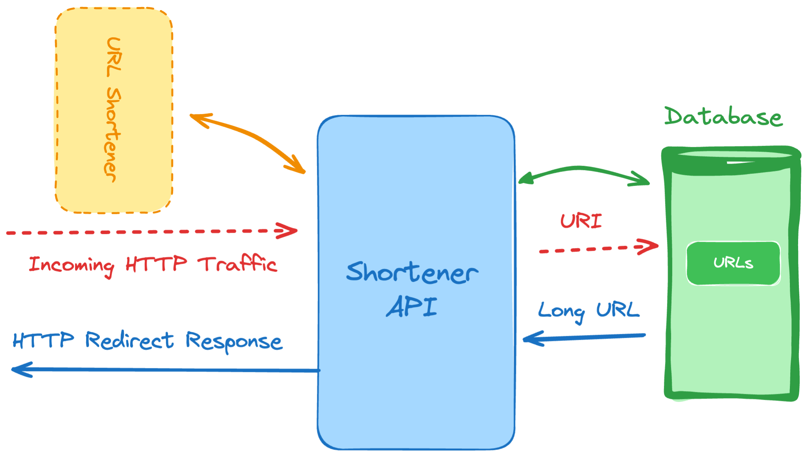

# 6. URL Shortening Service

```
Difficulty: Moderate

Skills and technologies used: Database indexing, HTTP redirects, RESTful endpoints
```

```
We’re now moving away from your standard APIs, and tackling URL shortening. This is a very common service, which allows you to shorten very long URLs, especially when looking to share them on social media or make them easily memorable.

For this project idea let’s focus on the following features, which you should be more than capable of implementing on your local environment, no matter your OS.

    Ability to pass a long URL as part of the request and get a shorter version of it. You’re free to decide how you’ll perform the shortening .

    Save the shorter and longer versions of the URL in the database to be used later during redirection.

    Configure a catch-all route on your service that gets all the traffic (no matter the URI used), finds the correct longer version and performs a redirection so the user is seamlessly redirected to the proper destination.
    
```
## Project Flow

1. `server.js` starts the application.
2. `app.js` creates the Express app, loads environment variables, connects to MongoDB, and mounts the routes.
3. `routes/url.route.js` handles URL creation and redirection.
4. `models/url.model.js` defines the Mongoose schema for shortened URLs.
5. MongoDB stores the short code, original URL, and traffic counter.

## How The Project Works

- A client sends a `POST` request with a long URL in the body.
- The service normalizes the URL so it includes `http://` or `https://`.
- A random short code is generated and combined with the local base URL.
- The short and long versions are saved in MongoDB.
- When a user visits the short path, the service looks up the short code and redirects to the stored original URL.
- Each redirect increments the stored traffic counter.

## File Roles

### `server.js`
Starts the server using the port from `.env`.

### `app.js`
Creates the Express app, enables JSON parsing, mounts the URL routes under `/urls`, and connects to MongoDB.

```js
app.use(express.json());
app.use('/urls', Urlroutes);
```

### `routes/url.route.js`
Contains the two main endpoints:
- create a shortened URL
- redirect from the short code to the original URL

### `models/url.model.js`
Defines the Mongoose schema.

```js
const urlSchema = new mongoose.Schema(
  {
    urlshort: { type: String, required: true },
    shortrendom: { type: String, required: true },
    urllong: { type: String, required: true },
    traffic: { type: Number, required: true, default: 0 },
  },
  { timestamps: true }
);
```

## API Summary

| Action | Method | Route | Purpose |
| --- | --- | --- | --- |
| Create short URL | `POST` | `/urls` | Save a long URL and generate a short redirect URL |
| Redirect | `GET` | `/urls/:shortrendom` | Look up the short code and redirect to the original URL |

## Request Examples

### Create a short URL

```bash
curl -X POST http://localhost:5000/urls \
  -H "Content-Type: application/json" \
  -d '{"urllong":"example.com/some/very/long/path"}'
```

### Visit a short URL

```bash
curl -i http://localhost:5000/urls/abc123
```

## Environment Variables

Create a `.env` file with:

```env
PORT=5000
MONGODB_URI=mongodb://localhost:27017/url_shortener
```

## Development Notes

- The current implementation generates short codes with `Math.random()` and stores them in the database.
- Redirect hits increase the `traffic` value for the matching document.
- The service currently uses a local base URL when building `urlshort`.
- `mongoose` is already set up, so you can add indexes later if you want to enforce uniqueness on `shortrendom`.

## Learning Flow

Read the project in this order for the request lifecycle:

`server.js` -> `app.js` -> `routes/url.route.js` -> `models/url.model.js`
