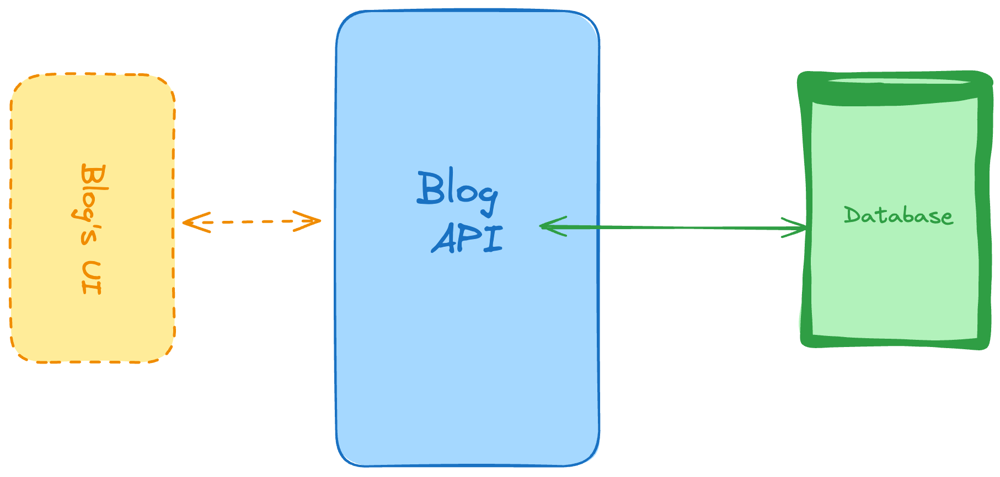
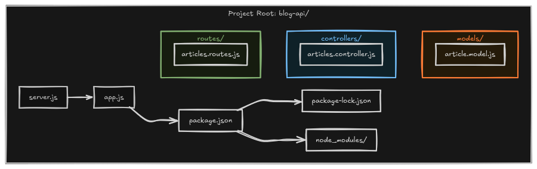

# 1. Personal Blogging Platform API

```
Difficulty: Easy

Skills and technologies used: CRUD for main operations, databases (SQL or NoSQL), server-side RESTful API.
```

```
Let’s start with a very common one when it comes to backend projects.

This is a RESTful API that would power a personal blog. This implies that you’d have to create a backend API with the following responsibilities:

    Return a list of articles. You can add filters such as publishing date, or tags.

    Return a single article, specified by the ID of the article.

    Create a new article to be published.

    Delete a single article, specified by the ID.

    Update a single article, again, you’d specify the article using its ID.

And with those endpoints you’ve covered the basic CRUD operations (Create, Read, Update and Delete).
```

## Project Flow



## How The Project Works

1. `server.js` starts the backend.
2. `app.js` creates the Express app, connects MongoDB, enables `express.json()`, and mounts the routes.
3. `routes/articles.routes.js` defines the article CRUD routes.
4. `controllers/articles.controller.js` contains the request logic.
5. `models/article.model.js` defines the Mongoose schema and model.
6. MongoDB stores and returns the article data.

## File Roles

### `server.js`
Starts the app on the selected port and keeps the server running.

### `app.js`
Handles Express setup, middleware, MongoDB connection, and route mounting.

```js
app.use(express.json());
app.use('/api', articlesRouter);
```

### `routes/articles.routes.js`
Keeps route definitions clean and forwards each request to the controller.

```js
router.get('/', listArticles);
router.post('/', createArticle);
router.get('/:id', getArticleById);
router.put('/:id', updateArticle);
router.delete('/:id', deleteArticle);
```

### `controllers/articles.controller.js`
Contains the main CRUD logic for articles.

### `models/article.model.js`
Defines the schema used by Mongoose.

```js
const articleSchema = new mongoose.Schema({
    title: { type: String, required: true },
    content: { type: String, required: true },
}, { timestamps: true });
```

## CRUD Summary

| Action | Method | Route | Purpose |
| --- | --- | --- | --- |
| Create | `POST` | `/api/articles` | Add a new article |
| Read All | `GET` | `/api/articles` | List every article |
| Read One | `GET` | `/api/articles/:id` | Get one article by id |
| Update | `PUT` | `/api/articles/:id` | Update article by id |
| Delete | `DELETE` | `/api/articles/:id` | Remove article by id |

## Learning Flow

When you come back to this project later, read it in this order:

`server.js` -> `app.js` -> `routes/articles.routes.js` -> `controllers/articles.controller.js` -> `models/article.model.js`

That gives you the full request flow from startup to MongoDB.
