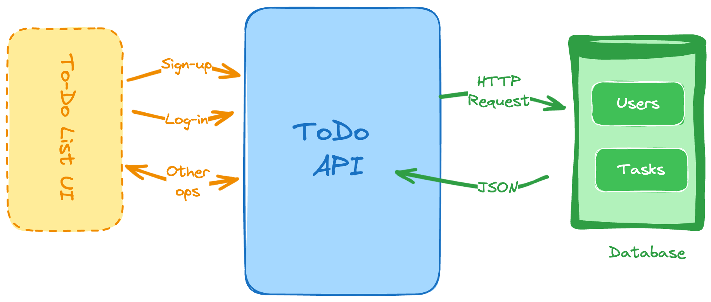

# 2. To-Do List API

```
Difficulty: Easy

Skills and technologies used: REST API design, JSON, basic authentication middleware.
```

```
We’re continuing with the APIs for our backend project ideas, this time around for a To-Do application. Why is it different from the previous one?

While the previous project only focused on the main CRUD operations, here we’ll add some more interesting responsibilities, such as:

    An authentication logic, which means you’ll have to keep a new table of users and their credentials

    You’ll have to create both users and tasks.

    You’ll also have to be able to update tasks (their status) and even delete them.

    Get a list of tasks, filter them by status and get the details of each one.

You’re free to implement this with whatever programming language and framework you want, however, you could continue using the same stack from the previous project
```

### Key Features:
- **User Registration**: Create new user accounts with password hashing (bcryptjs)
- **User Login**: Authenticate users and issue JWT tokens
- **Protected Routes**: Task endpoints require valid JWT tokens
- **Task Management**: Create, read, update, delete tasks per user
- **User Isolation**: Each user only sees their own tasks

## Project Flow

```
User Registration/Login Flow:
[Backend] → POST /api/auth/register or /api/auth/login
         ↓
[auth.controller.js] → Hash password / Verify password
         ↓
[user.model.js] → Save user / Retrieve user
         ↓
[JWT] → Generate token (for login)
         ↓
[Response] → Send token to client
```

```
Task Management Flow:
[Backend + JWT Token] → POST/GET/PUT/DELETE /api/tasks
         ↓
[authMiddleware] → Verify token, extract user
         ↓
[task.controller.js] → Process request
         ↓
[task.model.js] → Save/Retrieve/Update/Delete task
         ↓
[Response] → Return task data
```

## How The Project Works

1. `server.js` starts the backend on the configured PORT.
2. `app.js` creates the Express app, connects to MongoDB, enables middleware, and mounts routes.
3. `middleware/auth.js` verifies JWT tokens on protected routes.
4. `routes/auth.routes.js` defines register and login endpoints.
5. `routes/task.routes.js` defines task CRUD endpoints (all protected by authMiddleware).
6. `controllers/auth.controller.js` handles user registration and login logic.
7. `controllers/task.controller.js` handles task CRUD operations.
8. `models/user.model.js` defines the User schema with email uniqueness and password hashing.
9. `models/task.model.js` defines the Task schema with user_id reference and status tracking.
10. MongoDB stores user and task data; Mongoose manages schema validation.

## File Roles

### `server.js`
Starts the app on the PORT from `.env` and keeps the server running.

```js
const app = require('./app');
const PORT = process.env.PORT;
app.listen(PORT, () => {
  console.log(`Server is running on port ${PORT}`);
});
```

### `app.js`
Handles Express setup, middleware, MongoDB connection, and route mounting.

```js
app.use(express.json());
app.use(cors());
app.use('/api/auth', authRoutes);
app.use('/api/', taskRoutes);
```

### `middleware/auth.js`
Verifies JWT token in Authorization header and attaches authenticated user to request.

```js
const authMiddleware = async (req, res, next) => {
  const authHeader = req.headers.authorization;
  if (!authHeader || !authHeader.startsWith('Bearer ')) {
    return res.status(401).json({ message: 'Authorization header missing or malformed' });
  }
  const token = authHeader.split(' ')[1];
  try {
    const decoded = jwt.verify(token, process.env.JWT_SECRET);
    const user = await User.findById(decoded.id);
    if (!user) {
      return res.status(401).json({ message: 'User not found' });
    }
    req.user = user;
    next();
  } catch (error) {
    return res.status(401).json({ message: 'Invalid or expired token', error });
  }
};
```

### `routes/auth.routes.js`
Defines authentication endpoints (register and login). No middleware applied here so users can register/login without a token.

```js
router.post('/register', authController.register);
router.post('/login', authController.login);
```

### `routes/task.routes.js`
Defines task CRUD endpoints. All routes require `authMiddleware` to verify JWT.

```js
router.post('/tasks', authMiddleware, taskController.createTask);
router.get('/tasks', authMiddleware, taskController.getTasks);
router.put('/tasks/:id', authMiddleware, taskController.updateTask);
router.delete('/tasks/:id', authMiddleware, taskController.deleteTask);
```

### `controllers/auth.controller.js`
Handles user registration and login logic.

**register**:
- Checks if email already exists
- Hashes password with bcryptjs (salt rounds: 10)
- Creates new user in database

**login**:
- Finds user by email
- Compares hashed password with bcrypt
- Generates JWT token with user ID, expiry 1 hour
- Returns token to client

```js
module.exports.register = async (req, res) => {
  const { name, email, password } = req.body;
  const existingUser = await User.findOne({ email });
  if (existingUser) return res.status(400).json({ message: 'Email already exists' });
  const hashedPassword = await bcrypt.hash(password, 10);
  const user = await User.create({ name, email, password_hash: hashedPassword });
  res.status(201).json({ message: 'User registered successfully', user });
};
```

### `controllers/task.controller.js`
Handles task CRUD operations. Always filters tasks by `req.user._id` for user isolation.

```js
module.exports.createTask = async (req, res) => {
  const { title, description, status } = req.body;
  const task = await Task.create({ title, description, status, user_id: req.user._id });
  res.status(201).json(task);
};

module.exports.getTasks = async (req, res) => {
  const tasks = await Task.find({ user_id: req.user._id });
  res.json(tasks);
};
```

### `models/user.model.js`
Defines the User schema with email uniqueness, validation, and timestamps.

```js
const userSchema = new mongoose.Schema({
  name: { type: String, required: true, trim: true },
  email: { type: String, required: true, unique: true, lowercase: true, match: [/^.../, 'Valid email required'] },
  password_hash: { type: String, required: true, minlength: 6 },
  created_at: { type: Date, default: Date.now }
});
```

### `models/task.model.js`
Defines the Task schema with user reference, status enum, and pre-save middleware to update timestamps.

```js
const taskSchema = new mongoose.Schema({
  user_id: { type: mongoose.Schema.Types.ObjectId, ref: 'User', required: true },
  title: { type: String, required: true, trim: true },
  description: { type: String, trim: true },
  status: { type: String, enum: ['pending', 'in-progress', 'completed'], default: 'pending' },
  created_at: { type: Date, default: Date.now },
  updated_at: { type: Date, default: Date.now }
});

taskSchema.pre('save', function () {
  this.updated_at = Date.now();
});
```

## API Endpoints

### Authentication

| Action | Method | Route | Body | Purpose |
| --- | --- | --- | --- | --- |
| Register | `POST` | `/api/auth/register` | `{ name, email, password }` | Create a new user account |
| Login | `POST` | `/api/auth/login` | `{ email, password }` | Authenticate and receive JWT token |

### Tasks (All require JWT token in Authorization header)

| Action | Method | Route | Body | Purpose |
| --- | --- | --- | --- | --- |
| Create | `POST` | `/api/tasks` | `{ title, description, status }` | Add a new task for authenticated user |
| Read All | `GET` | `/api/tasks` | N/A | List all tasks for authenticated user |
| Read One | `GET` | `/api/tasks/:id` | N/A | Get one task by id (if owned by user) |
| Update | `PUT` | `/api/tasks/:id` | `{ title, description, status }` | Update task by id |
| Delete | `DELETE` | `/api/tasks/:id` | N/A | Remove task by id |

## Setup Instructions

### 1. Initialize project
```bash
npm init -y
```

### 2. Install dependencies
```bash
npm install express mongoose bcryptjs jsonwebtoken cors dotenv
npm install --save-dev nodemon
```

### 3. Create `.env` file
```
MONGODB_URI=mongodb://localhost:27017/todo-api
JWT_SECRET=your-secret-key-here
PORT=3000
```

### 4. Create file structure
```
todo-api/
├── server.js
├── app.js
├── .env
├── package.json
├── middleware/
│   └── auth.js
├── routes/
│   ├── auth.routes.js
│   └── task.routes.js
├── controllers/
│   ├── auth.controller.js
│   └── task.controller.js
├── models/
    ├── user.model.js
    └── task.model.js

```

### 5. Run the server
```bash
npm run dev
```

Server will start on http://localhost:3000

## Testing Workflow

### Register a new user
```bash
curl -X POST http://localhost:3000/api/auth/register \
  -H "Content-Type: application/json" \
  -d '{"name":"John Doe","email":"john@example.com","password":"password123"}'
```

### Login to get JWT token
```bash
curl -X POST http://localhost:3000/api/auth/login \
  -H "Content-Type: application/json" \
  -d '{"email":"john@example.com","password":"password123"}'
```

### Create a task (use token from login response)
```bash
curl -X POST http://localhost:3000/api/tasks \
  -H "Content-Type: application/json" \
  -H "Authorization: Bearer YOUR_TOKEN_HERE" \
  -d '{"title":"Learn Node.js","description":"Study async/await","status":"in-progress"}'
```

### Get all tasks
```bash
curl -X GET http://localhost:3000/api/tasks \
  -H "Authorization: Bearer YOUR_TOKEN_HERE"
```

## Learning Flow

When you come back to this project later, read it in this order:

1. `server.js` — How the server starts
2. `app.js` — Express setup and middleware
3. `middleware/auth.js` — JWT verification logic
4. `routes/auth.routes.js` → `controllers/auth.controller.js` — User registration and login
5. `models/user.model.js` — User schema definition
6. `routes/task.routes.js` → `controllers/task.controller.js` — Task CRUD operations
7. `models/task.model.js` — Task schema with pre-save hook

This gives you the full request flow from startup through authentication to task management with MongoDB.

## Key Concepts Covered

- **JWT Authentication**: Stateless token-based authentication
- **Password Hashing**: bcryptjs with salt rounds for security
- **Middleware**: Custom middleware to protect routes
- **Schema Relationships**: Task references User via user_id
- **User Isolation**: Database queries filtered by authenticated user
- **CRUD Operations**: Full Create, Read, Update, Delete pattern
- **Error Handling**: Proper HTTP status codes and error messages
- **CORS**: Cross-Origin Resource Sharing for frontend integration
