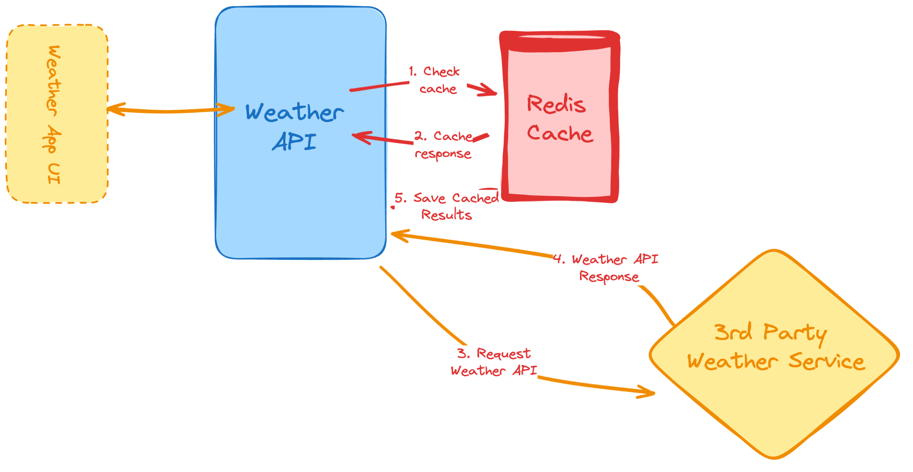

# 3. Weather API Wrapper Service

```
Difficulty: Easy

Skills and technologies used: Third-party API integration, caching strategy, environment variable management.
```

```
Let’s take our API magic to the next level with this new backend project. Now instead of just relying on a database, we’re going to tackle two new topics:

    Using external services.

    Adding caching through the use of a quick in-memory storage.

As for the actual weather API to use, you can use your favorite one, as a suggestion, here is a link to Visual Crossing’s API, it’s completely FREE and easy to use.

Regarding the in-memory cache, a pretty common recommendation is to use Redis, you can read more about it here, and as a recommendation, you could use the city code entered by the user as the key, and save there the result from calling the API.

At the same time, when you “set” the value in the cache, you can also give it an expiration time in seconds (using the EX flag on the SET command). That way the cache (the keys) will automatically clean itself when the data is old enough (for example, giving it a 12-hours expiration time).
```

## Project Flow

```
Client → GET /weather/:city
	↓
routes/weather.routes.js → routes the request to the controller
	↓
controllers/weather.controller.js → checks Redis cache first
	↓
config/redis.js → shared Redis client connection
	↓
services/weather.services.js → calls the external weather API
	↓
Redis → stores cached weather response for future requests
```

## How The Project Works

1. `server.js` starts the backend and serves a simple welcome route at `/`.
2. `app.js` creates the Express app, enables JSON parsing, loads environment variables, and mounts the weather routes.
3. `routes/weather.routes.js` defines the weather endpoint.
4. `controllers/weather.controller.js` handles the cache lookup and response shaping.
5. `config/redis.js` creates the Redis client and connects to Redis.
6. `services/weather.services.js` calls the external weather API using the configured base URL and API key.
7. Redis stores a simplified weather response by city so repeated requests are faster.

## File Roles

### `server.js`
Starts the app on the selected port and adds a root route.

```js
app.get('/', (req, res) => {
  res.send('Welcome to the Weather API Wrapper!');
});
```

### `app.js`
Handles Express setup, JSON middleware, environment loading, and route mounting.

```js
app.use(express.json());
app.use('/weather', weatherRoutes);
```

### `routes/weather.routes.js`
Keeps the route definition clean and forwards requests to the controller.

```js
router.get('/:city', weatherController.getWeather);
```

### `controllers/weather.controller.js`
Controls the request flow for a city lookup.

It first checks Redis for a cached entry using a key like `weather:guwahati`. If a cached response exists,
it returns that data immediately. Otherwise it calls the external API, extracts the fields the client needs,
stores them in Redis with a TTL, and returns the new response.

```js
const cacheKey = `weather:${city.toLowerCase()}`;
```

### `config/redis.js`
Creates the Redis client and connects once when the app starts.

```js
const redisClient = redis.createClient();
await redisClient.connect();
```

### `services/weather.services.js`
Contains the external API request logic.

```js
const url = `${baseUrl}/current.json?key=${apiKey}&q=${encodeURIComponent(city)}&aqi=no`;
```

## API Endpoints

| Action | Method | Route | Purpose |
| --- | --- | --- | --- |
| Welcome | `GET` | `/` | Show a simple server message |
| Get Weather | `GET` | `/weather/:city` | Get current weather data for a city |

### Weather Response Shape

The controller returns a simplified response like this:

```json
{
  "location": "Guwahati",
  "temperature": 28.4,
  "condition": "Partly cloudy"
}
```

## Setup Instructions

### 1. Initialize project
```bash
npm init -y
```

### 2. Install dependencies
```bash
npm install express redis dotenv axios
npm install --save-dev nodemon
```

### 3. Create `.env` file
```
PORT=3000
WEATHER_API_KEY=your-weather-api-key
WEATHER_API_BASE_URL=https://api.weatherapi.com/v1
CACHE_TTL_SECONDS=3600
```

### 4. Create file structure
```
weather-api-wrapper/
├── server.js
├── app.js
├── .env
├── package.json
├── config/
│   └── redis.js
├── controllers/
│   └── weather.controller.js
├── routes/
│   └── weather.routes.js
├── services/
│   └── weather.services.js
└── test/
    └── testRedis.js
```

### 5. Run the server
```bash
npm run dev
```

Server will start on http://localhost:3000

## Testing Workflow

### Check the root route
```bash
curl http://localhost:3000/
```

### Request weather for a city
```bash
curl http://localhost:3000/weather/guwahati
```

The first request should be a cache miss. Repeating the same request should return a cache hit until the TTL expires.

### Test Redis directly
```bash
node test/testRedis.js
```

## Learning Flow

When you come back to this project later, read it in this order:

1. `server.js` — How the server starts and exposes the root route
2. `app.js` — Express setup and route mounting
3. `routes/weather.routes.js` — The API entry point for weather lookups
4. `controllers/weather.controller.js` — Cache lookup and response formatting
5. `config/redis.js` — Redis client connection
6. `services/weather.services.js` — External weather API integration

This gives you the full request flow from the client to Redis and the external API.

## Key Concepts Covered

- External API integration
- Redis caching with TTL
- Request normalization by city name
- Environment-based configuration
- Response shaping before sending data to the client
